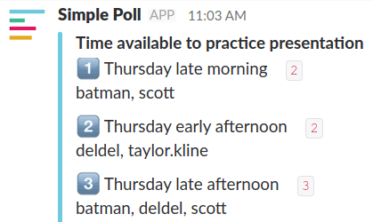

@title[Introduction]

#  Playlistr 

## by the Hackappellas

|  *Taylor Kline*  |   *Nick Ginther*  | *Scott Jackson* |
|:---------------:|:------------------:|:---------------:|
| *David Letourneau* | *Kshitij Delvadiya* |

---

@title[Demonstration]

[Website demonstration @fa[external-link fa-pad-left]](http://hackappellas.me/)

---

@title[What we did well]

### What did we do well?

- Organized team by strengths
- Code quality is clean and robust
- Website looks appealing
- Proactively cached Spotify API data
- Speed and responsiveness

---

@title[What we learned]

### What we learned

- JavaScript ES6 (`let` and `const`, object destructuring, etc.)
- Automated scaling (Kubernetes) & automated deployment (Travis)

---

@title[What we can do better]

### What we can do better

- Finding better APIs than Spotify & Last.FM
- Cleaner search results page

---

@title[What puzzles us]

### What puzzles us?

- Spotify API documentation & models
- Slack username choices

---

@title[What they did well]

### What they did well

- Website design is beautiful
- Navigation is simple and intuitive
- Filters are specific and provide many options
- Information doesn't overwhelm the user

---

@title[What we learned from them]

### What we learned from loldb

- Model pages demonstrate use of many graphics without cluttering
- Carousels for models enhance the experience
- Twitter feed provides extra information

---

@title[What they can do better]

### What they can do better

- Search keywords are listed at the end of the result, rather than highlighted where it appears

---

@title[What puzzles us about them]

#### What puzzles us about their site?

- https:// must be included or model pages won't load
- Champion items are served using ids, but API calls for items require a name

---

@title[Visualization]

[Visualization demonstration @fa[external-link fa-pad-left]](http://hackappellas.me/visualization)